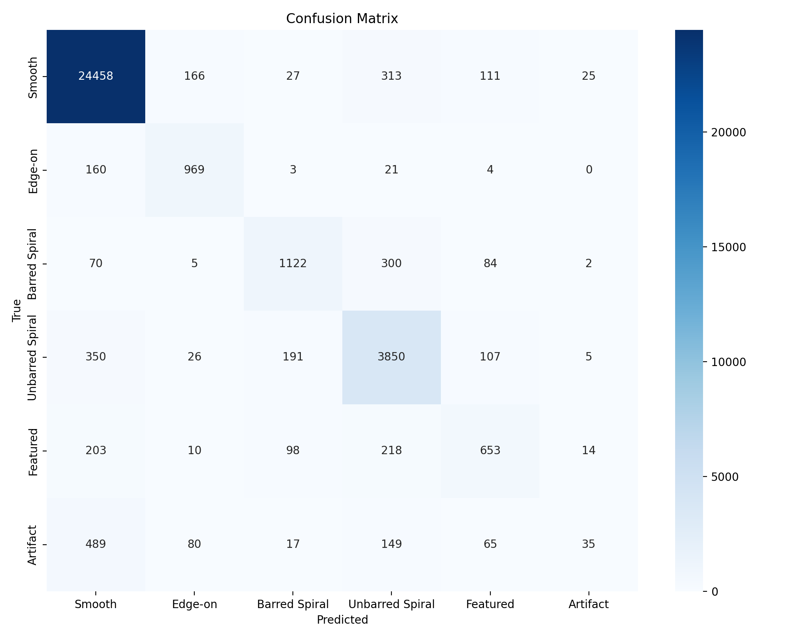

# 🌌 StarGPT: Galaxy Morphology Classification with Zoobot

**ECCE 635/787 Deep Learning Systems Design Project**
**Department of Electrical Engineering & Computer Science**

---

## 👥 Group Members
1. **Maryam Al Mesmari**
2. **Nada Kawde**
3. **Mohammed Ali Alyafeai**
4. **Abdelrhman Fathi Abdelfatah** 

---

## 🚀 Project Overview
**StarGPT** is a deep learning framework designed to automate the morphological classification of galaxies. As astronomical surveys (like Euclid and JWST) generate petabytes of data, manual classification becomes impossible. StarGPT leverages **Transfer Learning** to solve this bottleneck.

Utilizing the **Galaxy Zoo 2 (GZ2)** dataset and the pre-trained **Zoobot (ConvNeXt-Base)** encoder, this project fine-tunes a model to classify galaxies into 6 distinct morphological types:

1. **Smooth** (Elliptical)
2. **Edge-on** (Disk view)
3. **Barred Spiral**
4. **Unbarred Spiral**
5. **Featured** (Irregular/Odd)
6. **Artifact** (Stars/Satellite trails/Junk)

### Key Contributions
* **Transfer Learning:** Fine-tuning a model pre-trained on 100M+ galaxy votes (Zoobot).
* **Imbalance Handling:** Investigating **Focal Loss** and **Oversampling** to improve the detection of rare classes (Artifacts).
* **High Performance:** Achieving **~90.5% Accuracy** and **>0.98 AUROC** on major classes.

---

## 📂 Repository Structure
```text
StarGPT/
│
├── notebooks/                  # Source Code
│   ├── 1_Baseline_Training.ipynb    <-- Full run (172k samples, 50 epochs)
│   └── 2_Ablation_Study.ipynb       <-- Optimization runs (Focal Loss/Oversampling)
│
├── results/                    # Generated Plots & Metrics
│   ├── 1_Baseline_Training.ipynb    
│         ├── confusion_matrix.png
│         ├── auroc_per_class.png
│         └── learning_curve.png
│   └── 2_Ablation_Study.ipynb      
│         ├── confusion_matrix.png
│         ├── auroc_per_class.png
│         └── learning_curve.png
│
├── requirements.txt            # Python Dependencies
└── README.md                   # Project Documentation
```
---

## 📊 Dataset
We utilize the **Galaxy Zoo 2 (GZ2)** dataset hosted on Hugging Face.
- **Source:** https://huggingface.co/datasets/mwalmsley/gz2
- **Size:** ~240,000 images (Filtered to 172k for training).
- **Streaming:** The code is designed to stream data directly from the hub, requiring no local storage.

---

## 📈 Key Results

### 1. Quantitative Metrics
| Run Type | Accuracy | Smooth Recall | Artifact Recall |
| :--- | :--- | :--- | :--- |
| **Baseline (Cross Entropy)** | 89.9% | 0.97 | 0.04 | 
| **Oversampling** | 88.6% | 0.94 | 0.31 |
| **Focal Loss** | **90.01%** | 0.98 | 0.04| 
| **Both** | **88.6%** | 0.94 | 0.31| 

### Note: Smooth is the most frequent class in the dataset (=25100), and Artificial is the least frequent (=835)
### 2. Visualizations
**Confusion Matrix (Baseline):**


**Learning Curve (Baseline):**


**Auroc Per Class (Baseline):**


---

## 🛠️ How to Run
1. **Clone the repository:**
   git clone https://github.com/YOUR_USERNAME/StarGPT-Galaxy-Morphology.git
   cd StarGPT-Galaxy-Morphology

2. **Install dependencies:**
   pip install -r requirements.txt

3. **Run the Notebooks:**
   Open notebooks/1_Baseline_Training.ipynb in Jupyter Lab or Google Colab. Run all cells sequentially. The code will automatically handle data streaming and model downloading.

---

## 💾 Model Checkpoint
Due to GitHub file size limits (100MB max), the trained model weights (~350MB) are hosted externally.

* **Download Best Model (.ckpt) via Google Drive:**
  https://drive.google.com/drive/folders/1MpacoPCgib3GqTxkEBn5VfPMPpczuUzi

**To load this model in Python:**
```python
# Ensure the ZoobotWithFocalDropout class is defined in your script first
model = ZoobotWithFocalDropout.load_from_checkpoint("best.ckpt")
model.eval()
```

---

## 🔗 References
1. Zoobot: Walmsley, M. et al. "Zoobot: A convolutional neural network for galaxy morphology."
2. Galaxy Zoo 2: Willett, K. W. et al. MNRA (2013).
3. Frameworks: PyTorch Lightning, Hugging Face Datasets.


